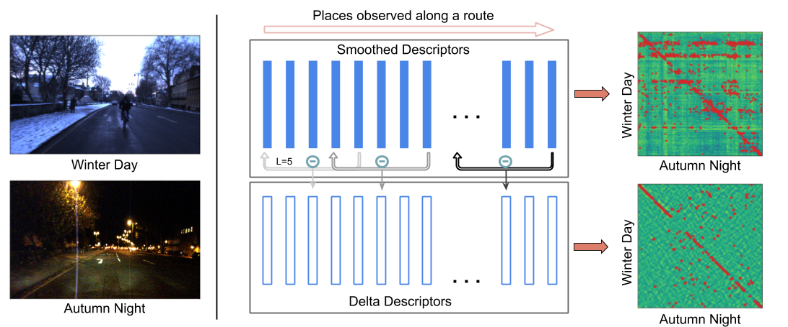

# Delta Descriptors

Source code for the paper - "Delta Descriptors: Change-Based Place Representation for Robust Visual Localization", published in IEEE Robotics and Automation Letters (RA-L) 2020 and to be presented at IROS 2020. [[arXiv](https://arxiv.org/abs/2006.05700)] [[IEEE Xplore](https://ieeexplore.ieee.org/document/9128035)]


We propose Delta Descriptor, defined as a high-dimensional signed vector of change measured across the places observed along a route. Using a difference-based description, places can be effectively recognized despite significant appearance variations.

Images on the left are from the [Oxford Robotcar](https://robotcar-dataset.robots.ox.ac.uk/) dataset.

## Requirements
```
matplotlib==2.0.2
numpy==1.15.2
tqdm==4.29.1
scipy==1.1.0
scikit_learn==0.23.1
```

See `requirements.txt`, generated using `pipreqs==0.4.10` and `python3.5.6`


## Usage

#### Download this Repository and the Nordland dataset (part)
The dataset used in our paper is available [here](https://zenodo.org/record/4016653#.X1WmYM8zZCV) (or use commands as below). Note that the download only comprises a small part (~1 GB) of the original Nordland videos released [here](https://nrkbeta.no/2013/01/15/nordlandsbanen-minute-by-minute-season-by-season/). These videos were first used for visual place recognition in [this](https://www.tu-chemnitz.de/etit/proaut/publications/openseqslam.pdf) paper.
```shell
git clone https://github.com/oravus/DeltaDescriptors.git
cd DeltaDescriptors/
mkdir data/
cd data/
wget https://zenodo.org/record/4016653/files/nordland-part-2020.zip
unzip nordland-part-2020.zip
```

The zip contains two folders: summer and winter, where each one of them comprises 1750 images which were used for experiments conducted in our paper.

#### Describe and Match
Delta Descriptors are defined on top of global image descriptors, for example, NetVLAD ([Update 05 Sep 2020: see our python wrapper](https://github.com/oravus/DeltaDescriptors/tree/master/thirdparty)). Given such descriptors, compute Delta Descriptors and match across two traverses as below:
``` shell
python src/main.py --genDesc --genMatch -l 16 -d delta -ip1 <full_path_of_desc.npy> -ip2 <full_path_of_query_desc.npy>
```
The input descriptor data is assumed to be a 2D tensor of shape `[numImages,numDescDims]`. The computed descriptors are stored in `.npy` format and the match results are stored in `.npz` format comprising a dict of two arrays: `matchInds` (matched reference index per query image) and `matchDists` (corresponding distance value). By default, output is stored in the `./out` folder but can also be specified via `--outPath` argument. To see all the options, use:
``` shell
python src/main.py --help
```
The options `--genDesc` and `--genMatch` can be used in isolation or together, see example usage below.

#### Describe only
In order to compute only the descriptors for a single traverse, use:
``` shell
python src/main.py --genDesc -l 16 -d delta -ip1 <full_path_of_desc.npy>
```

#### Match only
For only computing matches, given the descriptors (Delta or some other), use:
``` shell
python src/main.py --genMatch -ip1 <full_path_of_desc.npy> -ip2 <full_path_of_query_desc.npy>
```

#### Evaluate only
``` shell
python src/main.py --eval -mop <full_path_of_match_output.npz>
```
or evaluate directly with `--genMatch` (and possibly `--genDesc`) flag: 
``` shell
python src/main.py --eval --genMatch -ip1 <full_path_of_desc.npy> -ip2 <full_path_of_query_desc.npy>
```
Currently, only Nordland dataset-style (1-to-1 frame correspondence) evaluation is supported, GPS/INS coordinates-based evaluation, for example, for Oxford Robotcar dataset to be added soon. Evalution code can be used to generate PR curves and the code in its current form prints Precision @ 100% Recall for localization radius of 1, 5, 10 and 20 (frames). 

## Citation
If you find this code or our work useful, cite it as below:
```
@article{garg2020delta,
  title={Delta Descriptors: Change-Based Place Representation for Robust Visual Localization},
  author={Garg, Sourav and Harwood, Ben and Anand, Gaurangi and Milford, Michael},
  journal={IEEE Robotics and Automation Letters},
  year={2020},
  publisher={IEEE},
  volume={5},
  number={4},
  pages={5120-5127},  
}
```

## License
The code is released under MIT License.

## Related Projects
[CoarseHash (2020)](https://github.com/oravus/CoarseHash)

[seq2single (2019)](https://github.com/oravus/seq2single)

[LoST (2018)](https://github.com/oravus/lostX)


